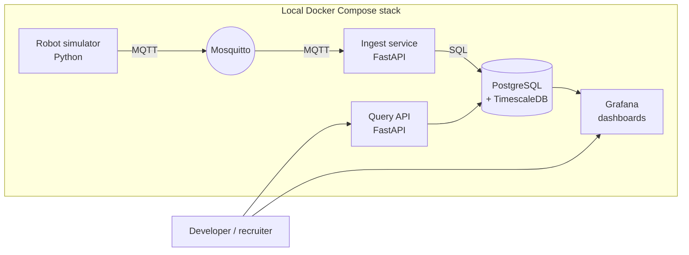

# Architecture — cloud-robotics-monitor

## Goals

- Demonstrate a clean, modern telemetry pipeline for industrial robots
- Stay laptop-friendly (CPU only, < 2 GB RAM)
- Be migration-ready to AWS without rewrites

## Non-goals

- Multi-tenant SaaS
- High-throughput Kafka cluster
- Real robot integration
- Security/auth hardening (this is a learning repo)

## System overview

## Components

| Component | Responsibility | Tech |
|-----------|----------------|------|
| **Simulator** | Generate realistic robot telemetry (joint state, currents, temperature, faults) | Python, `asyncio`, `paho-mqtt` |
| **Mosquitto** | MQTT broker between simulator and ingest | Eclipse Mosquitto |
| **Ingest API** | Subscribe to MQTT, validate (Pydantic), batch-insert into Postgres | FastAPI + `asyncpg` |
| **PostgreSQL** | Persistent storage of telemetry | Postgres 16 + optional TimescaleDB hypertables |
| **Query API** | REST endpoints for last-N points, error history, statistics | FastAPI |
| **Grafana** | Pre-provisioned dashboards: live joint plot, fault counter, latency overview | Grafana with provisioning |

## Data flow

1. Simulator publishes a `RobotTelemetry` message to MQTT topic `robots/<id>/telemetry` every 50 ms
2. Ingest service subscribes, validates payload, batches every 200 ms, writes to `telemetry` table
3. Grafana queries Postgres directly (read-only user) and renders dashboards
4. Query API is independent — used by external consumers or future ML services

## Data model (initial)

| Field | Type | Notes |
|-------|------|-------|
| `time` | `timestamptz` | TimescaleDB hypertable key |
| `robot_id` | `text` | e.g. `robot-01` |
| `joint_positions` | `float[]` | length matches robot DOF |
| `joint_currents` | `float[]` | amps |
| `temperature_c` | `float` | controller temperature |
| `error_code` | `int` | 0 = OK |
| `payload_raw` | `jsonb` | full original message for future fields |

## Key design decisions

| Decision | Rationale | Alternative considered |
|----------|-----------|-------------------------|
| **MQTT (not Kafka)** | Industry standard for robotics/IoT, lighter on a laptop | Kafka — overkill |
| **Postgres + Timescale** | Familiar SQL, time-series-friendly extension | InfluxDB — adds another DB to learn |
| **FastAPI for both ingest & query** | One framework, type-safe | Separate gateway/consumer |
| **Docker Compose for orchestration** | Recruiter can run with one command | k8s — too heavy for learning repo |
| **No auth in v1** | Learning scope, local-only | Add JWT in cloud-deploy phase |

## Performance targets (laptop)

- Simulator: 20 Hz per robot, up to 10 robots = 200 msg/s
- Ingest latency: < 100 ms from publish to DB write
- Memory: full stack < 2 GB RAM

## Migration path to AWS (Scope C)

| Local | AWS counterpart |
|-------|------------------|
| Mosquitto | AWS IoT Core (MQTT) |
| FastAPI ingest | AWS App Runner or ECS Fargate |
| PostgreSQL | RDS Postgres or Aurora Serverless v2 |
| Grafana | Amazon Managed Grafana (free tier) or self-hosted on EC2 t4g.micro |

## Testing strategy

- **Unit** — Pydantic models, simulator state machine
- **Integration** — spin up Postgres + ingest container, publish synthetic MQTT, assert DB rows
- **Manual** — `docker compose up` then check Grafana dashboard renders
